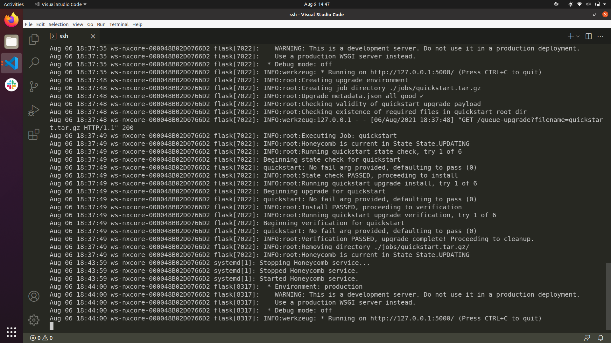

# Honeycomb quickstart 

Prerequisite: Honeycomb is installed

In the [upgrades](client/upgrades) directory, there is an unbuilt upgrade sample called [quickstart](client/upgrades/quickstart)

* build the quickstart upgrade 
```
./build_upgrade quickstart
```

* with honeycomb running, submit the following request: 
```
curl http://127.0.0.1:5000/queue-upgrade?filename=quickstart.tar.gz
```

Your upgrade is submitted! It should look like this: 

